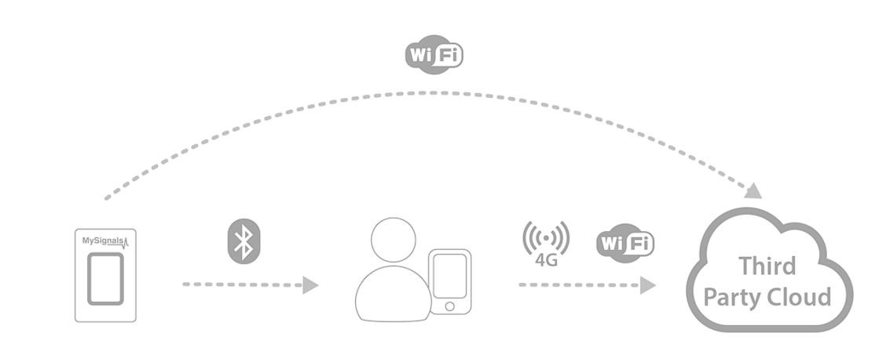
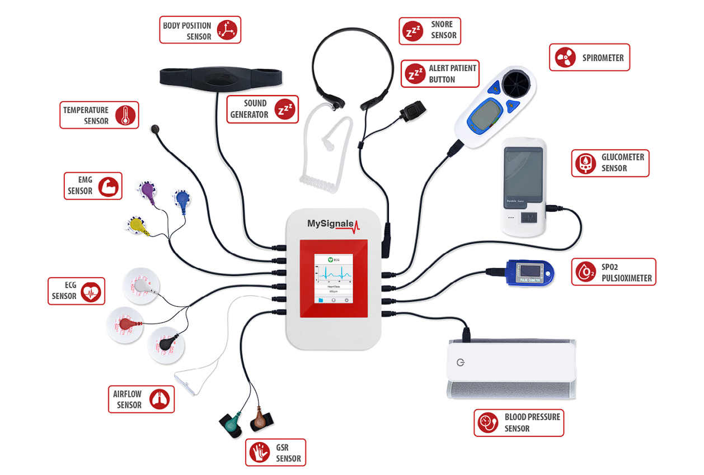
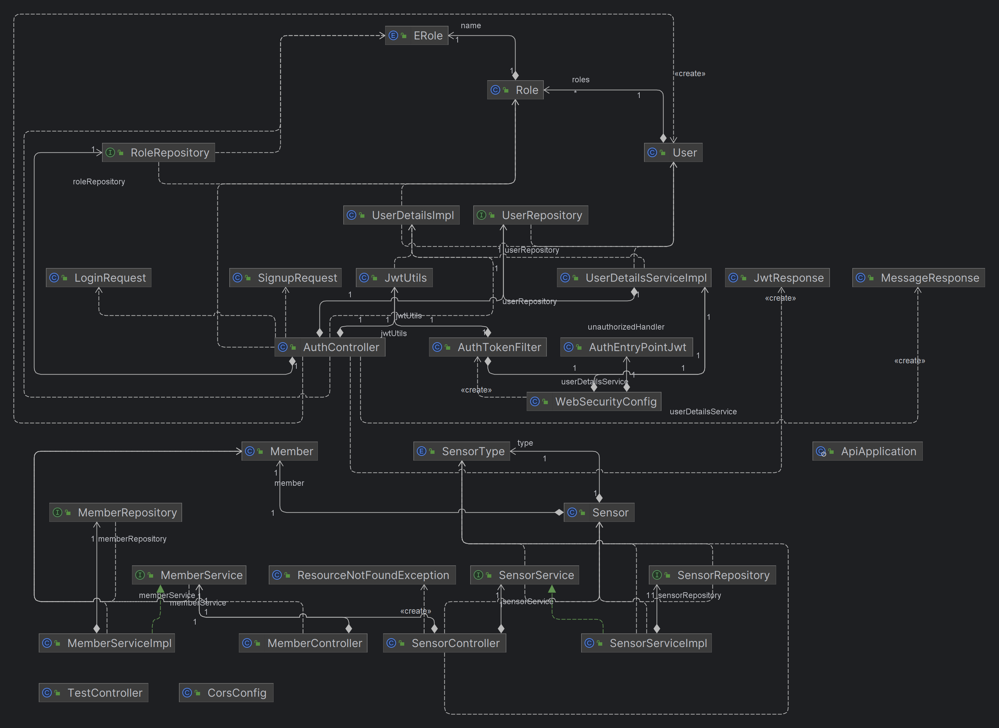
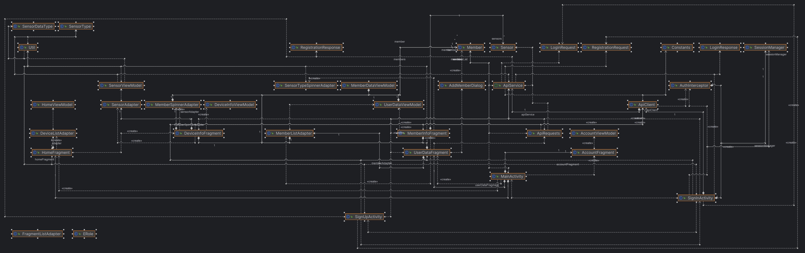

# My Signals project
Aboubacar BAH\
Taoufiq Boussraf

## Objectives

This project involves collecting health data in real time from a "MySignals" IoT device to which several sensors are connected. Once collected, this data needs to be stored in a personal cloud API to be visualised in the form of graphs.

**The main objectives are :** 

1. **Real-Time Data Collection:** Implement a solution to collect real-time data from health sensors connected to the MySignals IoT device.

2. **Integration of Multiple Sensors:** Enable the connection and integration of various types of health sensors such as ECG, EEG, temperature, blood pressure, glucose level, etc.

3. **Storage in Personal Cloud:** Develop a cloud API to securely store and manage collected data in a scalable manner.

4. **Data Visualization:** Create visualization features for data in the form of graphs and tables, allowing users to monitor and analyze collected health data.

5. **User-Friendly Interface:** Design a user-friendly interface that enables users to log in, view their data, and add new sensors data to the system.

6. **Data Security:** Implement security measures to protect sensitive health data stored in the personal cloud, using robust encryption and authentication methods.

7. **Multi-Platform Compatibility:** Ensure compatibility with different platforms, including mobile devices and computers, allowing users to access data from any device.

8. **Notifications and Alerts:** Integrate notification and alert features to inform users of abnormal fluctuations or critical situations in health data.

## Specifications

1. **MySignals IoT Configuration:** Configure and set up the MySignals IoT device by connecting appropriate sensors and configuring communication settings.

2. **Cloud API Development:** Design and establish a secure cloud API for storing and managing collected health data.

3. **Android App Development:** Create an attractive and intuitive user interface that allows users to log in, connecting to MySignals Device, view health data, and collect sensors data from the device.

4. **Data Visualization:** Develop interactive graphs and charts for visualizing health data provided by The Cloud API (By using an android App or a Web Application).

5. **Cloud Connectivity Integration:** Implement bidirectional communication between the MySignals device and the cloud API for real-time data transmission.

6. **Security and Authentication:** Implement security measures, including data encryption and authentication mechanisms, to ensure data confidentiality and integrity.

7. **Notifications and Alerts:** Integrate notification and alert mechanisms to inform users of important events related to their health data.

8. **Testing and Validation:** Perform comprehensive testing to ensure that data collection, storage, visualization, and management functions correctly and securely.

9. **Documentation and Training:** Provide a documentation on how to use the application, along with user training on adding sensors, viewing data, and interacting with the user interface.

10. **Deployment and Maintenance:** Deploy the cloud application and ensure ongoing maintenance to ensure optimal performance and updates as needed.

## API Development

The API is based SpringBoot API

### Tools

1. IntelliJ IDEA, Visual Studio Code...
2. Java JDK & JRE (Version >= 8)

### Architecture

### Services

In the SpringBoot API, we have three services : 

#### Sensors Service
The Sensors Service is responsible for managing the data related to various sensors used in the system. It implements CRUD (Create, Read, Update, Delete) operations to handle sensor information. This service allows you to perform the following actions:

- **Create:** Add new sensor information to the database, including details like sensor type, data units, and any other relevant metadata.
- **Read:** Retrieve sensor information from the database based on different criteria, such as sensor type or sensor ID.
- **Update:** Modify existing sensor information, such as updating sensor metadata or changing sensor properties.
- **Delete:** Remove sensor information from the database when a sensor is no longer needed or is replaced.

The Sensors Service plays a crucial role in storing and managing the characteristics and properties of different sensors within the system.

#### Member Service
The Member Service handles the management of member data within the system. Similar to the Sensors Service, it provides CRUD operations for member-related information. This service allows you to perform the following actions:

- **Create:** Add new member profiles to the system, including details like name, surname, profile picture, description, height, weight, and other relevant attributes.
- **Read:** Retrieve member profiles from the database based on different criteria, such as member ID or specific attributes.
- **Update:** Modify existing member profiles, including updating personal information or adjusting attributes like height and weight.
- **Delete:** Remove member profiles from the system when necessary.

The Member Service is essential for maintaining records of individuals associated with the health data and providing the necessary details for data analysis and visualization.

#### Authentication Service (JWT Authentication)
The Authentication Service is responsible for handling user authentication and authorization using JSON Web Tokens (JWT). It provides the necessary functionality to securely manage user access to the API endpoints. This service includes the following features:

- **User Registration:** Allow users to create accounts by providing necessary details, such as username, email, and password.
- **User Login:** Authenticate users by verifying their credentials and generating JWT tokens upon successful login.
- **Token Validation:** Verify the authenticity and integrity of incoming JWT tokens to ensure that users have valid access.
- **Authorization:** Control user access to specific endpoints and resources based on their roles and permissions stored within the JWT.
- **Token Refresh:** Provide the ability to refresh expired tokens, enabling users to extend their session without the need for frequent login.

The Authentication Service ensures that only authorized users can access the API endpoints and perform actions, contributing to the security and integrity of the system.

Overall, these three services work together to provide a comprehensive and secure platform for managing sensor data, member profiles, and user authentication within your Spring Boot API.

### Classes Diagram

### Database Management System (DBMS)

#### H2 Database (developpment)

#### POSTGRES + PGADMIN4 (deployment)

## Services Deployment 

### Docker compose file

### Github Pipeline (TODO)

## Android Application

### Tools

#### Android Studio or IntelliJ IDEA

#### Android SDK

### Architecture

### Classes Diagram

## Demo

### API

### Android App

## Improvements

## Sources

- Documentation : https://www.generationrobots.com/media/mysignals_technical_guide_sw.pdf
- JWT Authentication : https://github.com/bezkoder/spring-boot-spring-security-jwt-authentication.git

- Android Libelium library : 

